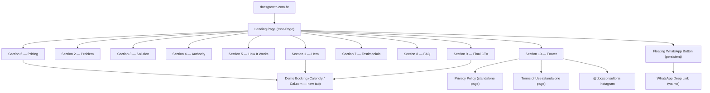
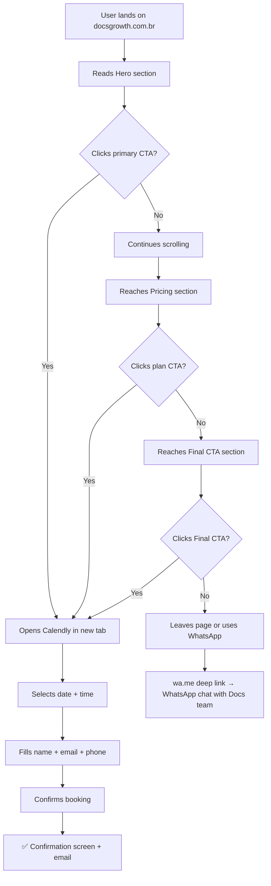
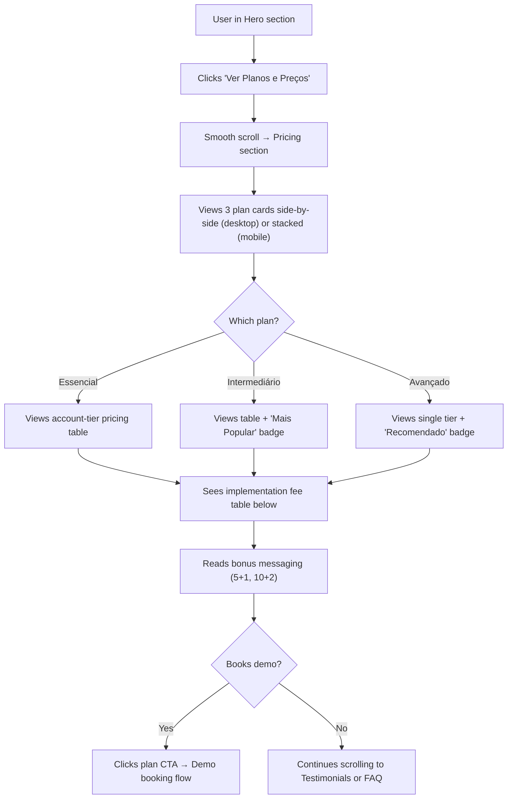
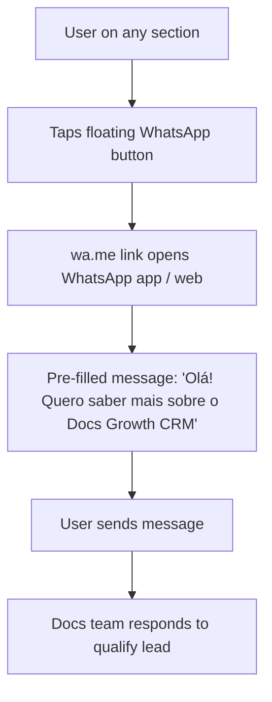

# Docs Growth CRM — UI/UX Specification

> **Project:** Docs Growth CRM — Institutional/Sales Landing Page
> **Agent:** Uma (UX/UI Designer & Design System Architect) — Kaizen360 Aceleradora
> **Date:** March 2026 | **Version:** 1.0
> **Source:** docs/brief.md + docs/prd.md + ESCOPO_SITE_DOCS_GROWTH_CRM.docx

---

## Introduction

This document defines the user experience goals, information architecture, user flows, and visual design specifications for the **Docs Growth CRM** landing page interface. It serves as the foundation for frontend development, ensuring a cohesive, conversion-optimized, and user-centered experience for dental radiology clinic managers across Brazil.

### Overall UX Goals & Principles

#### Target User Personas

**Persona 1 — Rodrigo, o Gestor Sobrecarregado (Primary)**

| Attribute | Detail |
|---|---|
| **Age** | 35–55 |
| **Role** | Owner / Manager of a dental radiology clinic |
| **Location** | Mid-size Brazilian city |
| **Tech comfort** | Low-to-medium — uses WhatsApp, Instagram, Google |
| **Pain** | Does everything manually; can't take a vacation; losing dentist referrals |
| **Goal** | Automate operations and finally have time to grow the business |
| **Trigger** | Heard about Docs Growth CRM at a congress or from a colleague |
| **Device** | Primarily mobile (iPhone or Android) |
| **Decision style** | Trust-driven — buys from authority figures he already respects |

**Persona 2 — Dra. Camila, a Radiologista Empreendedora (Secondary)**

| Attribute | Detail |
|---|---|
| **Age** | 28–45 |
| **Role** | Dental radiologist who co-owns or recently opened a clinic |
| **Tech comfort** | Medium — uses practice management software |
| **Pain** | Expert in radiology, weak in management and commercial processes |
| **Goal** | Build a real business, not just a job |
| **Trigger** | Participant in the 12 Pillars Mentorship; recommended by Docs team |
| **Device** | Splits between mobile and desktop |
| **Decision style** | Research-driven — compares options; responds to data and peer proof |

---

#### Usability Goals

- **Comprehension speed:** Visitor understands the core value proposition within 30 seconds of landing (above the fold)
- **Friction-free booking:** Demo booking flow completed in under 2 minutes, with no account creation required
- **Pricing discoverability:** Visitor reaches the pricing section within 2 clicks/taps or 60 seconds of scrolling
- **Mobile-native comfort:** All CTAs reachable within thumb zone; no horizontal scroll; tap targets minimum 48×48px
- **Trust formation:** By the time the visitor reaches the pricing section, they must already believe Docs Consultoria is the authority in their niche
- **Error prevention:** Contact form validates inputs before submission; no dead-end states

#### Design Principles

1. **Empathy over jargon** — Write and design for clinic managers, not developers. No acronyms, no tech speak. Every word must resonate with someone who's "tired of doing everything alone."
2. **Authority at every section** — Each scroll must reinforce that Docs Consultoria is the definitive expert: 21 years, 200+ clinics, 100% NPS. Credibility is the #1 conversion lever.
3. **Conversion at every depth** — No dead zones. Every section ends with a visual path forward (anchor link, CTA, or social proof that maintains momentum).
4. **Mobile-native first** — Every layout decision is made for 375px first, then scaled up. Thumb-zone CTAs, stacked cards, readable font sizes.
5. **Premium without pretension** — Dark mode, orange accents, gold details communicate premium quality. But the copy must remain warm, direct, and accessible — never cold or corporate.

### Change Log

| Date | Version | Description | Author |
|---|---|---|---|
| March 2026 | 1.0 | Initial UI/UX Specification — YOLO mode from brief + PRD | Uma / Kaizen360 |

---

## Information Architecture

### Site Map / Screen Inventory

### Navigation Structure

**Primary Navigation:** Sticky top bar (optional for MVP) with anchor links: `Hero` | `Solução` | `Planos` | `FAQ` | `Agendar Demo` (CTA button). Collapses to hamburger menu on mobile. If not implemented in MVP, all navigation happens through inline anchor CTAs within sections.

**Secondary Navigation:** Section-to-section flow via inline CTA buttons and anchor links embedded in copy (e.g., "Ver Planos e Preços" in Hero scrolls to Pricing). No breadcrumbs needed for a single-page site.

**Breadcrumb Strategy:** Not applicable — single-page architecture. Legal pages (Privacy, Terms) include a "← Voltar" back link to the main landing page.

---

## User Flows

### Flow 1 — Primary: Demo Booking

**User Goal:** Schedule a free product demonstration with the Docs team.

**Entry Points:** Primary CTA in Hero section, CTA in each pricing plan card, Final CTA section, floating WhatsApp button (secondary path).

**Success Criteria:** User completes a booking in Calendly/Cal.com and receives a confirmation email.

**Edge Cases & Error Handling:**
- Calendly is unavailable → page should display a fallback message or WhatsApp link as alternative
- User abandons booking mid-flow → no data lost; Calendly handles partial session
- User on iOS Safari → `target="_blank"` opens new tab correctly; test explicitly

**Notes:** The `Lead` Facebook Pixel event must fire on every `.cta-demo` click, regardless of whether the user completes the booking.

---

### Flow 2 — Secondary: Pricing Evaluation

**User Goal:** Find and compare plans to determine which tier fits the clinic's size and budget.

**Entry Points:** "Ver Planos e Preços" anchor link in Hero, scroll-through from Section 5 (How It Works).

**Success Criteria:** User views all 3 plan cards, understands the pricing structure, and either books a demo or notes the plan for follow-up.

**Edge Cases & Error Handling:**
- Pricing tables overflow on mobile → tables must have `overflow-x: auto` horizontal scroll within card
- User confused by account tiers → FAQ item "Qual plano escolher?" can be added if needed in future

---

### Flow 3 — Tertiary: Contact via WhatsApp

**User Goal:** Reach the Docs team directly via WhatsApp without going through the demo booking tool.

**Entry Points:** Floating WhatsApp button (all sections), secondary link in Final CTA section.

**Success Criteria:** User opens WhatsApp with a pre-filled message directed to the Docs commercial team number.

**Edge Cases & Error Handling:**
- WhatsApp not installed on desktop → `wa.me` link opens WhatsApp Web in browser
- Number not saved on user's phone → pre-filled message ensures context even without prior contact

---

## Wireframes & Mockups

**Primary Design Files:** To be created in Figma by the design team. This document serves as the specification input for Figma work. Reference sites: [docsconsultoria.com](https://docsconsultoria.com) and [logycatecnologia.com.br](https://logycatecnologia.com.br).

### Key Screen Layouts

#### Screen 1 — Hero Section (Above the Fold)

**Purpose:** Capture attention in 3 seconds; communicate value proposition; drive first CTA click.

**Key Elements:**
- Left column (60% desktop / 100% mobile): Headline (H1), sub-headline (body large), primary CTA button (full-width on mobile), secondary anchor link
- Right column (40% desktop / hidden or below on mobile): Platform mockup image (notebook + mobile device)
- Below mockup: 3-badge social proof bar (200+ clínicas | 100% NPS | 21 anos) — full width on both
- Top badges: "Feito para Radiologia Odontológica" + "Powered by Docs Consultoria" — positioned above headline

**Interaction Notes:** Primary CTA must be visible without scrolling on all target devices. On mobile (375px), headline at max 36px, CTA button full-width, mockup image hidden or placed below the fold.

**Design File Reference:** `figma/docs-growth-crm/hero-section`

---

#### Screen 2 — Pricing Section

**Purpose:** Present all plan options clearly; trigger demo booking decision.

**Key Elements:**
- Section header: H2 title + brief intro copy
- 3 plan cards in a row (desktop) / stacked (mobile): each with module name, description, pricing table, bonus messaging, CTA button
- Intermediário card: elevated with border highlight (`#E87722`), "Mais Popular" badge at top
- Avançado card: "Recomendado" badge, single pricing row (no account tiers)
- Implementation fee table: separate row below plan cards, spanning full width
- Bonus info row: "Semestral: Pague 5, ganhe 1" and "Anual: Pague 10, ganhe 2" in muted text

**Interaction Notes:** Pricing tables inside cards must scroll horizontally on mobile. Plan cards on mobile must stack with clear visual separation. Highlight on Intermediário must not feel aggressive — use `#E87722` border and badge only.

**Design File Reference:** `figma/docs-growth-crm/pricing-section`

---

#### Screen 3 — FAQ Section

**Purpose:** Remove final purchase barriers through objection handling.

**Key Elements:**
- H2 section title
- 6 accordion items, each with: question (bold), expand/collapse chevron icon, answer text (revealed on expand)
- First item open by default on desktop
- All items closed on mobile (saves vertical space)

**Interaction Notes:** Accordion is exclusive — only one item open at a time. Chevron rotates 180° on open (CSS transform). Smooth height transition (300ms ease) on expand/collapse. ARIA attributes required: `aria-expanded`, `aria-controls`, `role="button"` on question element.

**Design File Reference:** `figma/docs-growth-crm/faq-section`

---

## Component Library / Design System

**Design System Approach:** Greenfield custom design system built from scratch using Atomic Design methodology. No existing design system to extend. Components will be implemented as semantic HTML + CSS (or framework components if Next.js/Astro is chosen). Design tokens defined in `:root` CSS custom properties.

### Core Components

#### Button

**Purpose:** Primary action trigger across all CTAs.

**Variants:**
- `primary` — Orange `#E87722` background, white text (all main demo CTAs)
- `secondary` — Transparent background, `#E87722` border and text (ghost style for non-primary CTAs)
- `whatsapp` — WhatsApp green `#25D366`, white icon + text (floating button)

**States:** Default → Hover (brightness +10%, scale 1.02) → Active (scale 0.98) → Disabled (opacity 0.5, cursor not-allowed) → Focus (2px `#E87722` outline, 2px offset)

**Usage Guidelines:** Use `primary` for all demo booking CTAs. Use `secondary` for anchor links styled as buttons. Never use more than one `primary` button in the same visual viewport.

---

#### Pain Point Card

**Purpose:** Communicate one specific clinic problem with empathy.

**Variants:** Default (icon + title + question text). No hover state needed — informational only.

**States:** Default. Cards do not have interactive states.

**Usage Guidelines:** Always use an icon that literally represents the pain (calendar for scheduling, WhatsApp logo for messaging scatter). Keep question text under 80 characters. Cards sit in a grid; do not use cards for navigation.

---

#### Feature Card

**Purpose:** Showcase one platform feature with icon and description.

**Variants:** Default + `featured` (optional gold border for AI Agent as differentiator).

**States:** Default → Hover (subtle elevation + `#E87722` border flash, 150ms).

**Usage Guidelines:** Icon must be descriptive, not decorative. Description max 2–3 lines. Grid layout: 1 col mobile, 2 col tablet, 3–4 col desktop.

---

#### Pricing Plan Card

**Purpose:** Present a subscription tier with full pricing and CTA.

**Variants:**
- `standard` — Essencial and Avançado
- `featured` — Intermediário (orange border, "Mais Popular" badge, slightly larger on desktop)

**States:** Default → Hover (elevation shadow). CTA button has its own states (see Button component).

**Usage Guidelines:** Intermediário must visually demand attention without making the other plans feel inferior. Pricing tables inside cards use `overflow-x: auto` for mobile.

---

#### FAQ Accordion Item

**Purpose:** Show one Q&A pair in an expandable format.

**Variants:** Collapsed (question + chevron) → Expanded (question + chevron rotated + answer).

**States:** Collapsed → Expanded (300ms ease height transition). Focus state on question element.

**Usage Guidelines:** Question text in `font-weight: 600`. Answer text in regular weight with `line-height: 1.6`. Chevron is purely decorative — `aria-hidden="true"`.

---

#### Testimonial Card

**Purpose:** Display one social proof testimonial.

**Variants:** Default (photo + name + clinic + city + quote).

**States:** Default only (carousel handles navigation, not individual cards).

**Usage Guidelines:** Photo must be circular crop, minimum 64×64px. Quote must be in quotation marks. Name in bold. Clinic + City in muted text below name.

---

#### Social Proof Badge

**Purpose:** Display a key authority stat in a compact inline format.

**Variants:** Text-only (number + description) or icon + text.

**States:** Static — no interaction.

**Usage Guidelines:** Used in the Hero social proof bar. 3 badges displayed in a row (desktop) or 1×3 column (mobile). Numbers in `#E87722`, description in white.

---

#### Floating WhatsApp Button

**Purpose:** Persistent access to WhatsApp contact on all scroll depths.

**Variants:** Icon-only (mobile) / Icon + label "Fale conosco" (desktop).

**States:** Default → Hover (scale 1.05 + shadow pulse). Position: fixed, bottom-right, `z-index: 999`.

**Usage Guidelines:** Must not overlap page CTA buttons. Minimum 56×56px tap target. Add entry animation (slide-in from right, 500ms delay after page load).

---

## Branding & Style Guide

### Visual Identity

**Brand Guidelines:** Custom design for Docs Growth CRM, aligned with Docs Consultoria visual identity (dark mode, orange accent) and Logyca Tecnologia technology aesthetic. Reference: docsconsultoria.com.

### Color Palette

| Color Type | Hex Code | Usage |
|---|---|---|
| Primary (CTA) | `#E87722` | All primary buttons, highlights, accent borders, key numbers |
| Background (Base) | `#1A1A2E` | Page background, section backgrounds |
| Surface (Card) | `#242440` | Card backgrounds, slightly lighter than base |
| Surface Alt | `#2E2E50` | Hover states on cards, input backgrounds |
| White | `#FFFFFF` | Primary text on dark backgrounds, button text |
| Gold (Premium) | `#C9A84C` | "Recomendado" badge, premium detail accents |
| Muted Text | `#9CA3AF` | Secondary body text, descriptions, captions |
| Border | `#3D3D60` | Card borders, dividers, input borders |
| Success | `#22C55E` | Form success states, confirmation messages |
| Warning | `#F59E0B` | Cookie banner, important notices |
| Error | `#EF4444` | Form errors, destructive actions |
| WhatsApp | `#25D366` | Floating WhatsApp button only |

**Dark mode is the ONLY mode.** No light mode required for MVP.

### Typography

#### Font Families

- **Primary:** Poppins (Google Fonts or self-hosted) — used for all headings and body text
- **Secondary:** None — single font family keeps the design clean
- **Monospace:** Not needed for MVP (no code snippets or terminal UI)

#### Type Scale

| Element | Desktop Size | Mobile Size | Weight | Line Height | Usage |
|---|---|---|---|---|---|
| H1 | 56px / 3.5rem | 36px / 2.25rem | 700 (Bold) | 1.1 | Hero headline |
| H2 | 40px / 2.5rem | 28px / 1.75rem | 700 (Bold) | 1.2 | Section titles |
| H3 | 28px / 1.75rem | 22px / 1.375rem | 600 (SemiBold) | 1.3 | Card titles, feature names |
| H4 | 20px / 1.25rem | 18px / 1.125rem | 600 (SemiBold) | 1.4 | Sub-labels, plan names |
| Body Large | 18px / 1.125rem | 16px / 1rem | 400 (Regular) | 1.6 | Hero sub-headline, section intros |
| Body | 16px / 1rem | 15px / 0.9375rem | 400 (Regular) | 1.6 | Card descriptions, FAQ answers |
| Small | 14px / 0.875rem | 13px / 0.8125rem | 400 (Regular) | 1.5 | Muted text, pricing descriptions |
| Caption | 12px / 0.75rem | 12px / 0.75rem | 400 (Regular) | 1.4 | Legal text, footnotes |
| Button | 16px / 1rem | 15px / 0.9375rem | 600 (SemiBold) | 1 | CTA button labels |
| Price | 32px / 2rem | 28px / 1.75rem | 700 (Bold) | 1 | Pricing numbers |

### Iconography

**Icon Library:** Phosphor Icons (MIT license, tree-shakeable, consistent stroke weight) — preferred over Heroicons or Lucide for its variety of business/clinic-relevant icons. Fallback: Heroicons if team has existing setup.

**Usage Guidelines:**
- Size: 24×24px standard, 32×32px for feature cards, 48×48px for How It Works steps
- Color: `#E87722` for functional/accent icons; `#FFFFFF` for button icons; `#9CA3AF` for decorative/muted icons
- All icons must have `aria-label` or be marked `aria-hidden="true"` if decorative
- Stroke weight: 1.5px consistent (Phosphor "Regular" variant)

### Spacing & Layout

**Grid System:**
- Mobile (320–767px): 1 column, 16px horizontal margin, 16px gutter
- Tablet (768–1023px): 12 columns, 24px horizontal margin, 16px gutter
- Desktop (1024–1439px): 12 columns, 64px horizontal margin, 24px gutter
- Wide (1440px+): 12 columns, auto margin (max-width: 1280px centered), 24px gutter

**Spacing Scale (4px base):**

| Token | Value | Common Use |
|---|---|---|
| `space-1` | 4px | Icon padding, tight inline gaps |
| `space-2` | 8px | Button internal padding (vertical) |
| `space-3` | 12px | Small gaps between related elements |
| `space-4` | 16px | Standard component padding, grid margin mobile |
| `space-6` | 24px | Card internal padding, section sub-element gaps |
| `space-8` | 32px | Card gap in grids, between title and content |
| `space-12` | 48px | Section internal vertical padding |
| `space-16` | 64px | Section-to-section vertical gap |
| `space-24` | 96px | Large section padding (Hero top/bottom) |
| `space-32` | 128px | Maximum section separation on wide screens |

---

## Accessibility Requirements

### Compliance Target

**Standard:** WCAG 2.1 AA — minimum requirement for all interactive and content elements.

### Key Requirements

**Visual:**
- Color contrast ratios: Minimum 4.5:1 for normal text; 3:1 for large text (H1/H2) and UI components. White on `#1A1A2E` = 16.8:1 ✅. White on `#E87722` = 3.1:1 (acceptable for large button text at 16px SemiBold). `#9CA3AF` on `#1A1A2E` = 5.1:1 ✅.
- Focus indicators: 2px solid `#E87722` outline, 2px offset on all interactive elements. Never remove `outline: none` without providing a custom visible replacement.
- Text sizing: Minimum 12px for any visible text. Body text minimum 15px on mobile. No text rendered as images.

**Interaction:**
- Keyboard navigation: All interactive elements (buttons, links, accordion triggers, carousel controls) reachable and activatable via keyboard (`Tab`, `Enter`, `Space`). Logical tab order follows visual reading order.
- Screen reader support: All images have descriptive `alt` text. Decorative images use `alt=""`. Icons that convey meaning have `aria-label`. Section headings create meaningful document outline (h1 → h2 → h3 hierarchy).
- Touch targets: Minimum 48×48px for all tappable elements on mobile. Floating WhatsApp button minimum 56×56px. Pricing table has `overflow-x: auto` with visual scroll indicator.

**Content:**
- Alternative text: All platform mockup images, team photos, and feature icons have descriptive alt text. Social proof badges with icons are readable without the icon.
- Heading structure: One `<h1>` (Hero headline). Each section has one `<h2>`. Card titles use `<h3>`. Subheadings within cards use `<h4>` or `
` depending on context.
- Form labels: Contact form fields each have a visible `<label>` or `aria-label`. Required fields marked with `aria-required="true"`. Error messages associated with fields via `aria-describedby`.

### Testing Strategy

1. **Automated:** `axe-core` browser extension scan on complete page before launch (target: 0 critical, 0 serious violations)
2. **Color contrast:** Verified manually with WebAIM Contrast Checker for all text/background combinations
3. **Keyboard navigation:** Manual tab-through of all sections verifying focus visibility and logical order
4. **Screen reader:** Basic test with VoiceOver (iOS/Mac) on mobile view for primary user flow (Hero → Pricing → CTA)
5. **Touch targets:** Verified on real iPhone 12 viewport and Android Chrome DevTools

---

## Responsiveness Strategy

### Breakpoints

| Breakpoint | Min Width | Max Width | Target Devices |
|---|---|---|---|
| Mobile S | 320px | 374px | Older/small iPhones |
| Mobile | 375px | 767px | iPhone 12–15, Android flagship phones |
| Tablet | 768px | 1023px | iPad, Android tablets, landscape phones |
| Desktop | 1024px | 1439px | Laptops, small monitors |
| Wide | 1440px | — | Large monitors, 4K displays |

### Adaptation Patterns

**Layout Changes:**
- Cards: 1 column (mobile) → 2 columns (tablet) → 3–4 columns (desktop)
- Hero: Stacked (text above, mockup below on mobile) → Side-by-side 60/40 (desktop)
- Pricing: Cards stacked vertically (mobile) → 3-column row (desktop)
- Footer: Single column (mobile) → 3-column grid (desktop)

**Navigation Changes:**
- Mobile: No sticky nav for MVP (all navigation via inline CTAs and scroll). Optional hamburger menu if nav bar is implemented.
- Desktop: Optional sticky top nav with anchor links and demo CTA button.
- Floating WhatsApp button: Icon-only on mobile (56×56px) → Icon + "Fale conosco" label on desktop.

**Content Priority:**
- Hero mockup image: Below fold on mobile (text + CTA first); right column on desktop.
- Team photos: Single row scroll (mobile) → 3-column grid (desktop).
- Pricing tables: Horizontal scroll inside card (mobile) → Full-width table (desktop).
- Testimonials carousel: 1 card visible (mobile) → 2–3 cards visible (desktop).

**Interaction Changes:**
- Pricing tables: `overflow-x: auto` with `-webkit-overflow-scrolling: touch` on mobile.
- Carousel: Swipe gesture on mobile; prev/next buttons on desktop.
- Accordion: All items closed on mobile; first item open on desktop.
- Hero CTA: Full-width button on mobile; `auto` width (max 320px) on desktop.

---

## Animation & Micro-interactions

### Motion Principles

- **Purposeful motion:** Every animation must serve a function (guide attention, confirm action, indicate state change). No decorative animations for their own sake.
- **Subtlety:** Small movements, not theatrical ones. Duration ≤ 400ms for most transitions.
- **Performance:** Animate only `transform` and `opacity` properties (GPU-accelerated). Never animate `width`, `height`, or `margin`.
- **Accessibility:** All scroll-triggered and decorative animations must respect `prefers-reduced-motion: reduce`. Set `animation: none` and `transition: none` under reduced motion.
- **Easing:** Use `ease-out` for enter animations (feels natural/physical). Use `ease-in` for exit animations. Use `ease-in-out` for state changes.

### Key Animations

- **CTA Button Hover:** Scale 1.02 + brightness 110% (Duration: 150ms, Easing: ease-out)
- **CTA Button Active:** Scale 0.98 (Duration: 100ms, Easing: ease-in)
- **Feature Card Hover:** translateY(-4px) + box-shadow deepens (Duration: 150ms, Easing: ease-out)
- **FAQ Accordion Open:** Max-height 0 → auto + chevron rotate 180° (Duration: 300ms, Easing: ease-in-out)
- **FAQ Accordion Close:** Max-height auto → 0 + chevron rotate 0° (Duration: 250ms, Easing: ease-in)
- **Section Enter (Scroll-triggered):** opacity 0 → 1 + translateY 24px → 0 (Duration: 500ms, Easing: ease-out, Delay: staggered 100ms per card)
- **Testimonial Carousel Slide:** translateX with crossfade (Duration: 400ms, Easing: ease-in-out)
- **WhatsApp Button Entry:** slideInRight + opacity 0 → 1 (Duration: 400ms, Delay: 800ms after load, Easing: ease-out)
- **Pricing Badge Pulse:** Subtle glow pulse on "Mais Popular" badge (Duration: 2000ms, loop, reduced to static on `prefers-reduced-motion`)
- **Cookie Banner Entry:** slideUp from bottom (Duration: 300ms, Delay: 1500ms, Easing: ease-out)

---

## Performance Considerations

### Performance Goals

- **Page Load (LCP):** < 2.5 seconds on mobile (4G connection, Moto G4 equivalent)
- **Interaction Response (INP):** < 200ms for all user interactions (button clicks, accordion toggle, carousel swipe)
- **Animation FPS:** 60fps for all CSS animations (GPU-composited transforms only)
- **Total Page Weight:** < 2MB uncompressed, < 800KB compressed (gzip/brotli)

### Design Strategies

- **Hero image:** Platform mockup rendered as WebP (< 200KB), with JPEG fallback. Preloaded via `<link rel="preload">` in `<head>`. Dimensions specified to prevent layout shift.
- **Lazy loading:** All images below Section 1 use `loading="lazy"`. Team photos and testimonial images deferred until near viewport.
- **Font subsetting:** Load only Poppins Latin character subset (reduces WOFF2 from ~300KB to ~50KB). Use `font-display: swap` to prevent invisible text during load.
- **Icon approach:** Use inline SVG for critical above-fold icons (zero additional requests). Icon font or sprite sheet for below-fold icons.
- **CSS approach:** No CSS-in-JS at runtime. All styles compiled to static CSS at build time. CSS custom properties (design tokens) kept in `:root` — no runtime computation.
- **Third-party scripts:** GTM, Facebook Pixel loaded via `async` after page is interactive. Wrapped in cookie consent gate.
- **Pricing tables:** Rendered as pure HTML tables — no JavaScript required for display.
- **No blocking resources:** Zero render-blocking scripts. Fonts use `preconnect` to Google Fonts CDN (or self-hosted to eliminate external DNS lookup).

---

## Next Steps

### Immediate Actions

1. Share `docs/front-end-spec.md` with Docs Consultoria for review of personas, color palette, and copy direction
2. Create Figma project using this spec as the design brief — prioritize Hero, Pricing, and FAQ sections first
3. Collect visual assets from client: team photos (Dr. Fabio, Francisco, Letícia), platform screenshots for mockup, existing logo files (SVG preferred)
4. Confirm icon library choice (Phosphor vs. Heroicons) with dev team
5. Confirm Poppins font usage — obtain license confirmation if self-hosting
6. Pass `docs/prd.md` + `docs/front-end-spec.md` to `@architect` for frontend architecture document

### Design Handoff Checklist

- [x] All user flows documented (Demo Booking, Pricing Evaluation, WhatsApp Contact)
- [x] Component inventory complete (Button, Cards, Accordion, Carousel, Badges, Floating Button)
- [x] Accessibility requirements defined (WCAG 2.1 AA, contrast ratios, keyboard nav, touch targets)
- [x] Responsive strategy clear (4 breakpoints, layout adaptations per section)
- [x] Brand guidelines incorporated (colors, typography, Poppins, dark mode, orange accent)
- [x] Performance goals established (LCP < 2.5s, INP < 200ms, PageSpeed ≥ 90)
- [ ] Figma designs created (pending — next step)
- [ ] Visual assets received from client (pending — client action required)

---

## Checklist Results

*Accessibility WCAG checklist to be run after Figma designs are created and before development begins. Lighthouse accessibility audit to be run on staging URL before launch.*

---

*Docs Growth CRM — Feito por quem entende de Radiologia Odontológica.*
*UI/UX Specification generated by Uma (ux-design-expert) | Kaizen360 Aceleradora | March 2026*
